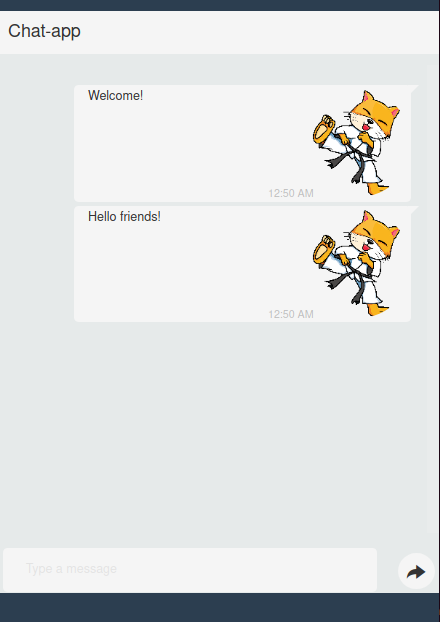

# Chat-app - AWS Lambda Sample Application

Welcome to the deployment repository for *chat-app* a sample API Gateway + Lambda sample application.

This repository contains source code for frontend and backend of a simple chat application as well as code to deploy the
whole application to Amazon Web Services (AWS).

This code is meant to serve as a playground for 
[AWS Lambda](https://docs.aws.amazon.com/lambda/latest/dg/welcome.html)
and
[AWS API Gateway](https://docs.aws.amazon.com/apigateway/latest/developerguide/welcome.html)
training.



The chat-app is a simple web application in which the user can enter chat messages which are distributed to all other
currently logged in users.

## The Application


The chat-app is composed out of a web frontend HTML page with a Javascript that sends and receives the chat messages via
a websocket connection to a backend. The backend distributes the messages to other clients.

The frontend web application is hosted on [AWS S3](https://docs.aws.amazon.com/AmazonS3/latest/userguide/Welcome.html).

The backend is implemented
via [AWS API Gateway](https://docs.aws.amazon.com/apigateway/latest/developerguide/welcome.html)
the offers the websocket end-points for sending and receiving chat messages.

The processing of chat-messages and connecting and disconnecting websocket clients is implemented in Javascript
functions executed by [AWS Lambda](https://docs.aws.amazon.com/lambda/latest/dg/welcome.html).

Currently active websocket connections are stored in the
[AWS DynamoDB](https://docs.aws.amazon.com/amazondynamodb/latest/developerguide/Introduction.html) database.

## Necessary rights in your AWS account

To be able to deploy the chat-app into your AWS account your user should to have the following IAM rights:

```json
{
  "Version": "2012-10-17",
  "Statement": [
    {
      "Sid": "IamPolicyAndRoleAccess",
      "Effect": "Allow",
      "Action": [
        "iam:ListPolicies",
        "iam:GetRole",
        "iam:GetPolicyVersion",
        "iam:ListRoleTags",
        "iam:UntagRole",
        "iam:GetPolicy",
        "iam:TagRole",
        "iam:ListEntitiesForPolicy",
        "iam:UpdateRoleDescription",
        "iam:DeletePolicy",
        "iam:ListRoles",
        "iam:CreateRole",
        "iam:AttachRolePolicy",
        "iam:GetRolePolicy",
        "iam:PutRolePolicy",
        "iam:CreatePolicy",
        "iam:DetachRolePolicy",
        "iam:ListPolicyVersions",
        "iam:ListAttachedRolePolicies",
        "iam:DeleteRolePolicy",
        "iam:UpdateRole",
        "iam:CreatePolicyVersion",
        "iam:ListRolePolicies",
        "iam:DeletePolicyVersion"
      ],
      "Resource": "*"
    },
    {
      "Sid": "StsAssumeRoleFullAccess",
      "Effect": "Allow",
      "Action": [
        "sts:*"
      ],
      "Resource": [
        "*"
      ]
    },
    {
      "Sid": "CloudShellFullAccess",
      "Effect": "Allow",
      "Action": [
        "cloudshell:*"
      ],
      "Resource": [
        "*"
      ]
    },
    {
      "Sid": "CloudWatchLogsFullAccess",
      "Effect": "Allow",
      "Action": [
        "logs:*"
      ],
      "Resource": [
        "*"
      ]
    },
    {
      "Sid": "S3FullAccess",
      "Effect": "Allow",
      "Action": [
        "s3:*"
      ],
      "Resource": [
        "*"
      ]
    },
    {
      "Sid": "LambdaFullAccess",
      "Effect": "Allow",
      "Action": [
        "lambda:*"
      ],
      "Resource": [
        "*"
      ]
    },
    {
      "Sid": "ApiGatewayFullAccess",
      "Effect": "Allow",
      "Action": [
        "apigateway:*"
      ],
      "Resource": [
        "*"
      ]
    },
    {
      "Sid": "DynamoDBFullAccess",
      "Effect": "Allow",
      "Action": [
        "dynamodb:*"
      ],
      "Resource": [
        "*"
      ]
    }
  ]
}
```

## Building and installation

The content of this repository is meant to be installed to an AWS account via the
[AWS Cloudshell](https://docs.aws.amazon.com/cloudshell/latest/userguide/welcome.html) executed in the same AWS account
running in the AWS region `eu-west-1` (Ireland).

The whole chat-app application is deployed via [Hashicorp terraform](https://www.terraform.io/docs/index.html).

The chat-app is deployed executing the following steps:

1. Login to your AWS Account
2. Change to region `Europe (Ireland) eu-west-1`
3. Start the service AWS CloudShell
4. Clone the complete git repository into the home directory within the AWS CloudShell.
5. Change to the root directory of the git repository: `# cd cloudshell_provisioning`
6. Load the shell script `bashrc_local` to install terraform, and editor and some shell aliases `# . ./bashrc_local`.
7. Change to the terraform provisioning directory `# cd chat-app/terraform`
8. Run terraform deployment via an alias set by `bashrc_local`: `# tfpa`

Tipp:
Add the following snipped to the `.bashrc` of the AWS CloudShell:

```bash
if [ -d ./cloudshell_provisioning ]; then
        cd ./cloudshell_provisioning 
        if [ -f ./bashrc_local ]; then
                . ./bashrc_local
        fi
fi
```

## Running the chat-app

1. Login to your AWS Account
2. Change to region `Europe (Ireland) eu-west-1`
3. Open the service AWS S3
4. Find and click the S3 bucket `8ac794582f-kabatrinkerlean-chat-app`
5. Find the `Bucket website endpoint` on the tab `Properties` at the very end of the properties beneath 
   `Static website hosting` 
6. Enter the URL of the bucket into your Web browser

## Content of the repository

```
+- README.md        - This documentation
+- img/             - Images for the documentation
+- bashrc_local     - Shell script to setup the AWS CloudShell
+- chat-app/        - Implementation of the chat-app
   +- src           - frontend and backend source code
   |  +- backend/   - Javascript AWS lambda functions implemeting the chat-app backend
   |  +- frontend/  - HTML + Javascript of the frontend
   +- terraform/    - Terraform deployment scripts
```

## Trainings

The following are some ideas what students can try out:

1. Move the whole application to a different AWS region. 
   * Remove `eu-west-1` deployment via terraform: `# tfd`
   * Select another region: `# export AWS_REGION=eu-central-1`
   * Redeploy via terraform: `# tfpa`
2. Distinguish your and other messages (other message come in from the left)
   * The frontend code in `chat-app/src/fronend/app.js` already allows to distinguish messages

## Acknowledgements

The Backend of the Chat-App is based on the Simple Chat-App provided by AWS:
https://github.com/aws-samples/simple-websockets-chat-app

The Frontend Web Application is based on the Bootstrap Snippet "Simple Chat"
by pablocorezzola: https://bootsnipp.com/snippets/y8e4W

The cat image is from Ralf Designs on Pixabay.

## Contact

* Bernd Haberstumpf <poldi@thatswing.de>
